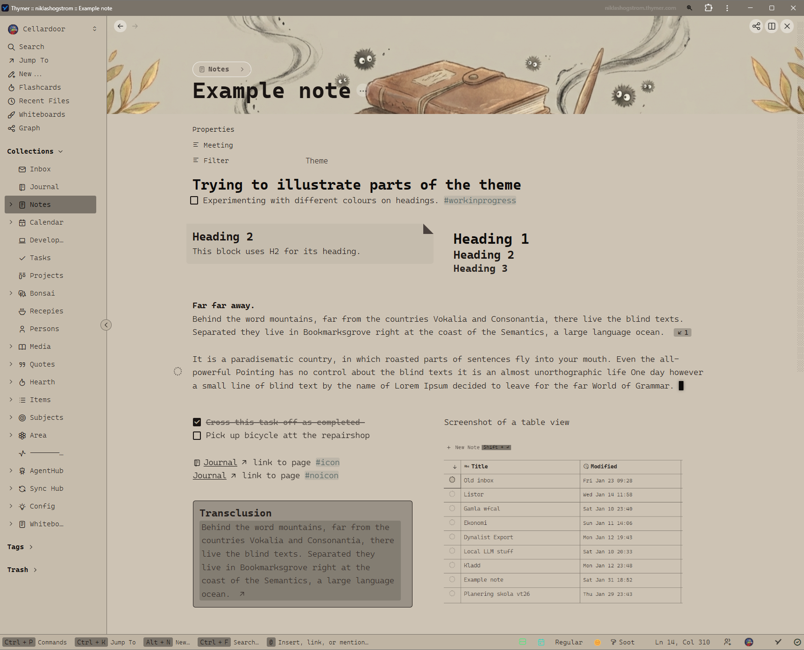

# Thymer-Daylight-Soot
Light theme aiming to not blind you during the night.

## How to apply theme:
1. Open the Daylight Soot CSS in this repository and copy (Ctrl + C) all of its contents.
2. Open up Thymer. Press Ctrl + P >  Upload Custom CSS > paste (Ctrl + V) > Click Save. 
3. Press Ctrl + P again > Set Theme & Dark or Light Appearance > Daylight Soot.

## To do / work in progress
- Highlight color in warning blocks

## Changelog
### 3/3-2026
- White side-panel-border is no more.
